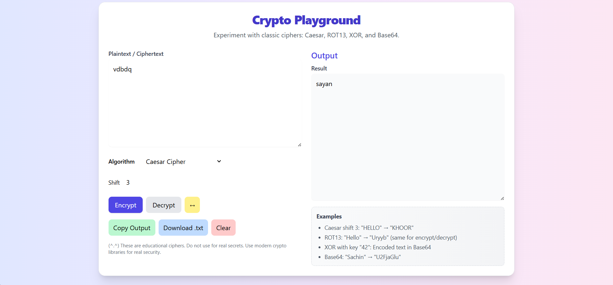

# CryptoPlayground  

A simple **cyber security project** – a web-based encryption & decryption tool built with **HTML, Tailwind CSS, and JavaScript**.  
This project demonstrates how classic and simple encryption algorithms work in a user-friendly playground.  

---

## Features
- **Algorithms Supported**
  - Caesar Cipher (with shift control)
  - ROT13 (fixed shift = 13)
  - XOR Cipher (with key input)
  - Base64 Encode/Decode
- Separate **Encrypt** and **Decrypt** modes
- Swap between input and output
- Copy result to clipboard
- Download output as a `.txt` file
- Clear input/output with one click
- Responsive and styled with **Tailwind CSS**

---

## Project Structure
## Setup & Usage
1. Clone or download the repository.
2. Open `index.html` in any modern browser.
3. Select an **Algorithm** from the dropdown.
4. Enter your **text** (and key if needed).
5. Click **Encrypt** or **Decrypt** to see the result.

---

## Screenshot

  ## 📸 Screenshot

---

## Algorithms Explained
### Caesar Cipher  
- Shifts each letter by a fixed number (e.g., shift = 3 turns A → D).  
- Simple substitution cipher, easy to break.  

### ROT13  
- Special case of Caesar Cipher with shift = 13.  
- Applying it twice restores the original message.  

### XOR Cipher  
- Each character is XOR’ed with a key (number or text).  
- Output is encoded in **Base64** for readability.  

### Base64  
- Encoding scheme (not true encryption).  
- Converts binary/text to readable ASCII.  

---

## Tech Stack
- **Frontend**: HTML5, Tailwind CSS
- **Logic**: JavaScript

---

## Possible Improvements
- Add **AES / DES demo** (using Web Crypto API)  
- Implement a **Dark Mode Toggle**  
- Add support for **file encryption/decryption**  

---

## License
This project is open-source and free to use for educational purposes.  
